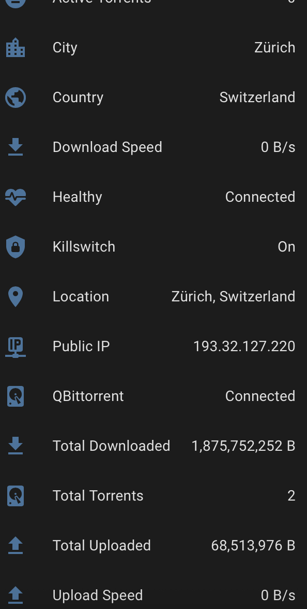

<p align="center">
  
</p>

<p align="center">
  <a href="https://github.com/jasondostal/tunnelvision-ha/releases"></a>
  <a href="https://github.com/hacs/integration"></a>
  
  
</p>

---

Native Home Assistant integration for [TunnelVision](https://github.com/jasondostal/tunnelvision). 23 entities, real-time SSE updates, config flow, zero YAML.

<p align="center">
  
</p>

## Install

### HACS (Recommended)

1. Open Home Assistant → HACS → Integrations
2. Click the three dots (top right) → **Custom Repositories**
3. Paste `https://github.com/jasondostal/tunnelvision-ha`
4. Select category **Integration** → click **Add**
5. Close the dialog → search for **TunnelVision** in the HACS store
6. Click **Download** → **Restart Home Assistant**

### Manual

1. Download the [latest release](https://github.com/jasondostal/tunnelvision-ha/releases)
2. Copy the `custom_components/tunnelvision/` folder into your HA `config/custom_components/` directory
3. Restart Home Assistant

## Setup

**Settings → Integrations → Add → TunnelVision** → enter host + port. Done.

> **Tip:** If HA runs in `network_mode: host`, use your server IP and the mapped port (e.g. `192.168.1.x:8181`). If HA is on the same Docker network, use the container name and internal port (e.g. `tunnelvision:8081`).

## What You Get

**12 sensors** — VPN state, public IP, country, city, location, download/upload speed, active/total torrents, total downloaded/uploaded, provider

**4 binary sensors** — VPN connected, killswitch active, healthy, qBittorrent running

**9 buttons** — Restart VPN, rotate server, disconnect, reconnect, restart qBit, pause/resume torrents, enable/disable killswitch

**3 services** — For automations:

```yaml
service: tunnelvision.vpn
data:
  action: restart  # disconnect, reconnect, rotate

service: tunnelvision.qbittorrent
data:
  action: restart  # pause, resume

service: tunnelvision.killswitch
data:
  action: enable  # disable
```

## Automations

<details>
<summary>Notify when VPN drops</summary>

```yaml
automation:
  - alias: "TunnelVision VPN Down"
    trigger:
      - platform: state
        entity_id: binary_sensor.tunnelvision_vpn_connected
        to: "off"
    action:
      - service: notify.mobile_app
        data:
          title: "VPN Down"
          message: "TunnelVision VPN disconnected"
```

</details>

<details>
<summary>Auto-reconnect after 1 minute</summary>

```yaml
automation:
  - alias: "TunnelVision Auto-Reconnect"
    trigger:
      - platform: state
        entity_id: binary_sensor.tunnelvision_vpn_connected
        to: "off"
        for: "00:01:00"
    action:
      - service: tunnelvision.vpn
        data:
          action: reconnect
```

</details>

<details>
<summary>Rotate server daily at 4am</summary>

```yaml
automation:
  - alias: "TunnelVision Daily Rotation"
    trigger:
      - platform: time
        at: "04:00:00"
    action:
      - service: tunnelvision.vpn
        data:
          action: rotate
```

</details>

<details>
<summary>Pause torrents when VPN drops</summary>

```yaml
automation:
  - alias: "TunnelVision Pause on VPN Drop"
    trigger:
      - platform: state
        entity_id: binary_sensor.tunnelvision_vpn_connected
        to: "off"
    action:
      - service: tunnelvision.qbittorrent
        data:
          action: pause
```

</details>

## MQTT Alternative

TunnelVision also supports **MQTT with auto-discovery**. Set `MQTT_ENABLED=true` in your TunnelVision container and entities appear in HA without this integration. Use whichever method fits your setup — this integration uses direct API polling (every 15s), MQTT provides real-time push.

## License

[MIT](LICENSE)
